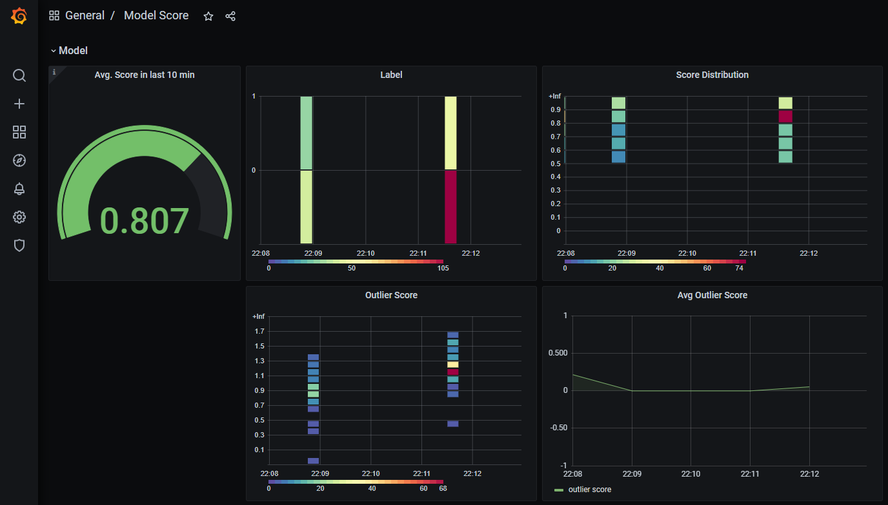

# ComMLOps

[PDF Version of the presentation](presentation/presentation.pdf)

## Requirements
* Conda installation (e.g. [Miniconda](https://docs.conda.io/en/latest/miniconda.html))
* Base environment with Jupyter, [nb_conda](https://anaconda.org/conda-forge/nb_conda) and [jupytext](https://jupytext.readthedocs.io/en/latest/install.html)
## Setup

After checkout, first create and activate the conda environment:
```
git clone https://github.com/mbunse/mlcomops.git
conda env create -f environment.yml
conda activate mlops
```

On Linux systems, adjust the permissions for the mounted volumes:
```
chmod -R o+w docker-compose/
```

Now, in order for the DVC files to be tracked, comment out the lowest highlighted section of the [.gitignore].

## Deploy required components

```
docker-compose build
docker-compose up
```

Create a bucket titanic in [Minio](http://localhost:9000).

## Initialize DVC

```
dvc init -f
dvc remote add -f -d minio s3://titanic/dvcrepo
dvc remote modify minio endpointurl http://localhost:9000
dvc remote modify --local minio access_key_id minio-access-key
dvc remote modify --local minio secret_access_key minio-secret-key
```

## Create dvc pipeline

Unignore DVC related files in [`.gitignore`](.gitignore) and comment out everything below
```
# DVC created during exercises
# ---- comment out starting from here when using dvc -----------
```
[Titanic dataset from OpenML](https://www.openml.org/d/40945)

Load data as dvc Stage create and run:
```
dvc run -n load_data --force -o ../data/interim/train_df.pkl -o ../data/interim/test_df.pkl -o ../data/interim/outlier_df.pkl -d load_data.pct.py -w notebooks python load_data.pct.py
```

Train model:

```
dvc run -n train --force -d ../data/interim/train_df.pkl -d train.pct.py -M ../models/score.json -o ../models/model.pkl -o ../models/feat_names.json -w notebooks python train.pct.py
```

Train Outlier Detector
```
dvc run -n outlier_detector --force -d ../data/interim/train_df.pkl -d ../data/interim/test_df.pkl -d ../models/feat_names.json -d ../models/model.pkl -d ../data/interim/outlier_df.pkl -o ../models/outlier_detector.pkl -w notebooks python outlier_detector.pct.py
```

Prepare Explainer
```
dvc run -n outlier_model --force -w notebooks -d ../data/interim/train_df.pkl -d ../data/interim/test_df.pkl -d ../models/feat_names.json -d ../models/model.pkl -d ../data/interim/outlier_df.pkl -o ../models/explainer.pkl python prepare_explainer.pct.py
```

Drift Detector
```
dvc run -n drift_model --force -w notebooks -d ../data/interim/train_df.pkl -d ../data/interim/test_df.pkl -d ../data/interim/outlier_df.pkl -d ../models/model.pkl -d ../models/feat_names.json -o ../models/drift_detector.pkl python drift_detector.pct.py
```

Push data to Minio bucket
```
dvc push
```

## Start the API:

```
python app.py
```

Find the documentation site for the API at http://127.0.0.1:8080/docs 

## Create API

While the Model API is running, run the following:
```
openapi-python-client generate --url http://127.0.0.1:8080/openapi.json
```

Shut down the API (Ctrl + C).

## Start setup from Prometheus, Grafana and Model API.

Prerequisite: 
* local [Docker](https://docs.docker.com/get-docker/) installation.
* run `docker-compose up` to have the needed infrastructure available 

```
docker build -t modelapi --build-arg AWS_ACCESS_KEY_ID=minio-access-key --build-arg AWS_SECRET_ACCESS_KEY=minio-secret-key --network="host" . 
```

Then restart the infrastructure containers and start the model API container:
```
chmod o+x docker-compose/modelapi/data
docker-compose -f docker-compose.yml -f docker-compose.modelapi.yml up
```

API: http://localhost:8080/docs

Test the API with

```
(cd notebooks && python call_api.pct.py)
```

## Monitoring

* [Open Grafana](http://localhost:3000) (username: `admin`, password: `12345`)
* [Open Prometheus](http://localhost:9090)


Inspired by [Jeremy Jordan
A simple solution for monitoring ML systems.
](https://www.jeremyjordan.me/ml-monitoring/)

## References:
* [fastAPI](https://fastapi.tiangolo.com/)
* [pydantic]()
* [dvc](https://dvc.org/)
* [openapi-python-client](https://github.com/openapi-generators/openapi-python-client)
* [prometheus-fastapi-instrumentator](https://github.com/trallnag/prometheus-fastapi-instrumentator)
* [Docker](https://docs.docker.com/get-docker/)
* [OpenShift](https://www.openshift.com/)
* [minishift](https://docs.okd.io/3.11/minishift/getting-started/index.html)
* [Grafana](https://grafana.com/)
* [Prometheus](https://prometheus.io/)
