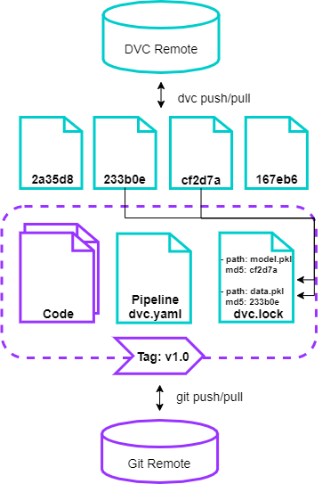

## Disclaimer

* Ich bin kein Jurist
* Kein Anspruch auf Vollständigkeit der rechtlichen & regulatorischen Anforderungen
* Meine private Ansicht, wie einige Anforderungen  umgesetzt werden könnten


## Automatisierung

<blockquote class="twitter-tweet"><p lang="en" dir="ltr">Machine learning pipelines <a href="https://t.co/5FpG3HrdW0">pic.twitter.com/5FpG3HrdW0</a></p>&mdash; AI Memes for Artificially Intelligent Teens (@ai_memes) <a href="https://twitter.com/ai_memes/status/1382374419666976771?ref_src=twsrc%5Etfw">April 14, 2021</a></blockquote> <script async src="https://platform.twitter.com/widgets.js" charset="utf-8"></script>


## Bevor das Projekt startet
## Datenschutz klären

Rechtsgrundlage für Verarbeitungszweck klären ([Art. 6 DSGVO](https://dsgvo-gesetz.de/art-6-dsgvo/)):  
* Einwilligung
* Erfüllung eines Vertrages
* rechtliche Vorgaben
* lebenswichtige Interessen der betroffenen Personen
* Wahrnehmung einer Aufgabe im öffentlichen Interesse
* berechtigtes Interesse

I.d.R. Datenschutzfolgeabschätzung erforderlich, da "automatisierte Verarbeitung" \([Art 35 Absatz 3 DSGVO](https://dsgvo-gesetz.de/art-35-dsgvo/)\). Auch die Listen der Landesdatenschutzbehörden sind zu beachten (z.B. [BayLDA: Liste der Verarbeitungstätigkeiten, für die eine DSFA durchzuführen ist](https://www.lda.bayern.de/media/dsfa_muss_liste_dsk_de.pdf))

## Verarbeitung von Mitarbeiterbezogenen Daten

Im Rahmen der betrieblichen Mitbestimmung ([§ 87 Absatz 1 Nr. 6](https://www.gesetze-im-internet.de/betrvg/__87.html)) ist der Betriebsrat über die Verarbeitung von Mitarbeiterdaten zu informieren.

## Berechtigungen
Zugriffsberechtigungen eng an Verarbeitungszweck koppeln und Personenkreis mit entsprechenden Zugriffsrechten festlegen (vgl. [Art 25 DSGVO](https://dsgvo-gesetz.de/art-25-dsgvo/)), z.B. über entspr. Berechtigungskonzept.

## Umsetzung

### Anforderungen
Datenschutzrechtliche Anforderungen ergeben sich zum Beispiel aus dem [Positionspapier der Datenschutz-Koferenz zu empfohlenen technischen und
organisatorischen Maßnahmen bei der Entwicklung und dem Betrieb
von KI-Systemen](https://www.datenschutzkonferenz-online.de/media/en/20191106_positionspapier_kuenstliche_intelligenz.pdf) von Nov. 2019.

Im Positionspapier gefordert (auszugsweise):
* Dokumentation der Auswahl des KI-Verfahrens (Abwägung zwischen Nachvollziehbarkeit und benötigter Mächtigkeit)
* Evaluation des ausgewählten KI-Verfahrens bezüglich alternativer, erklärbarerer KI-Verfahren
* Herkunft der Rohdaten klären
* Wahrung der Verfügbarkeit von Roh- und Trainingsdaten
* Verhinderung von unbefugten Manipulationen an KI-Komponenten
* Auskunftsmöglichkeit für Betroffene zum Zustandekommen von Entscheidungen und Prognosen
* Überwachung des Verhaltens der KI-Komponente
* Regelmäßige Prüfung der KI-Komponente auf Diskriminierungen und anderes unerwünschtes Verhalten
* Regelmäßige Prüfung der Güte des KI-Systems und seiner KI-Komponenten auf Basis der Betriebsdaten

In der Praxis können diese Punkte wie folgt gelöst werden:

* Reproduzierbarkeit: Versionierung von Daten und Code:
    * Herkunft der Rohdaten klären
    * Wahrung der Verfügbarkeit von Roh- und Trainingsdaten
    * Verhinderung von unbefugten Manipulationen an KI-Komponenten
* Experiment Tracking:
    * Dokumentation der Auswahl des KI-Verfahrens (Abwägung zwischen Nachvollziehbarkeit und benötigter Mächtigkeit)
    * Evaluation des ausgewählten KI-Verfahrens bezüglich alternativer, erklärbarerer KI-Verfahren
* Modell Erklärbarkeit:
    * Auskunftsmöglichkeit für Betroffene zum Zustandekommen von Entscheidungen und Prognosen
* Monitoring (On- und Offline):
    * Regelmäßige Prüfung der Güte des KI-Systems und seiner KI-Komponenten auf Basis der Betriebsdaten
    * Überwachung des Verhaltens der KI-Komponente
    * Regelmäßige Prüfung der KI-Komponente auf Diskriminierungen und anderes unerwünschtes Verhalten


## Reproduzierbarkeit

Random Seeds setzen, vgl. ["Verwirrung über R-Wert-Berechnung des RKI"](https://www.spiegel.de/politik/deutschland/robert-koch-institut-und-der-r-wert-ende-april-verwirrung-ueber-berechnung-a-264a8d9c-454f-499a-b729-e4b537688b72)
> Innerhalb dieser Simulation werden Zufallszahlen gezogen, die sich bei jedem Lauf des Programms leicht unterschiedlich ergeben und daher nicht exakt reproduzierbar sind.

Daten versionieren, z.B. mit DVC


## Diskriminierung

Benachteiligungsverbot gemäß [§ 19 AGG](https://www.gesetze-im-internet.de/agg/__19.html). Zulässige differenzierung nach Religion, einer Behinderung, Alters oder sexueller Identität, wenn "diese auf anerkannten Prinzipien risikoadäquater Kalkulation beruht" ([§ 20 Absatz 2 AGG](https://www.gesetze-im-internet.de/agg/__20.html))

https://towardsdatascience.com/real-life-examples-of-discriminating-artificial-intelligence-cae395a90070


## Löschkonzept

```
dvc gc -c -w  
```